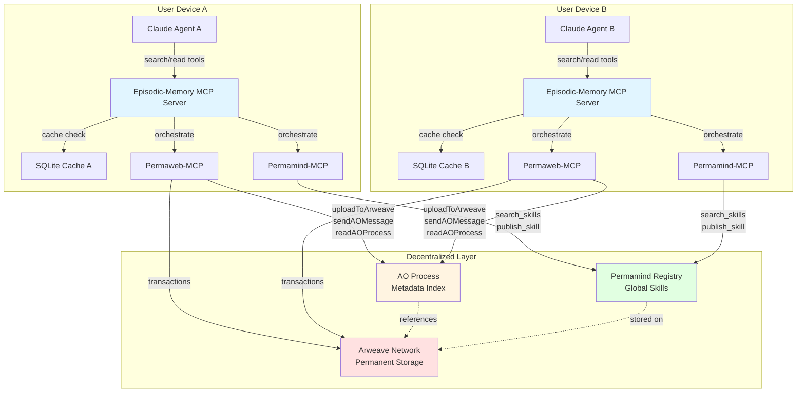
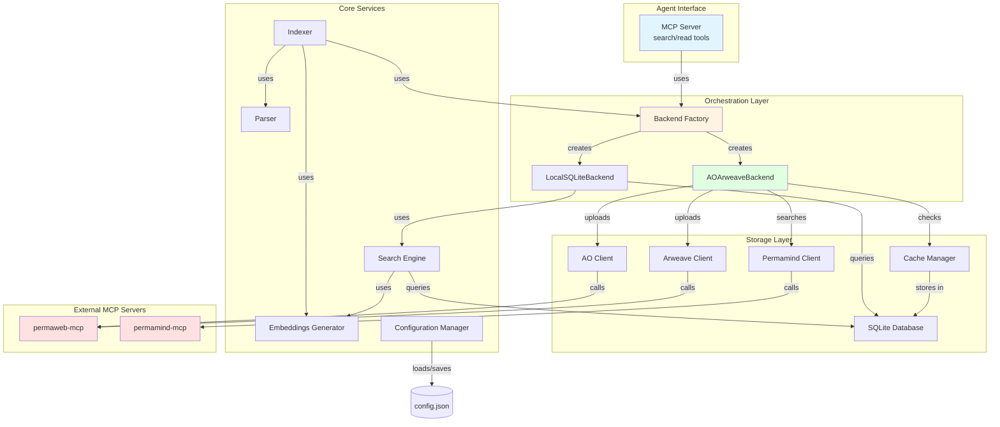
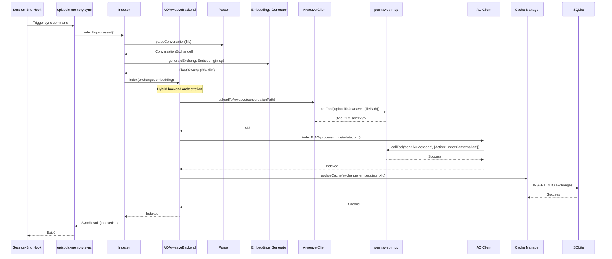
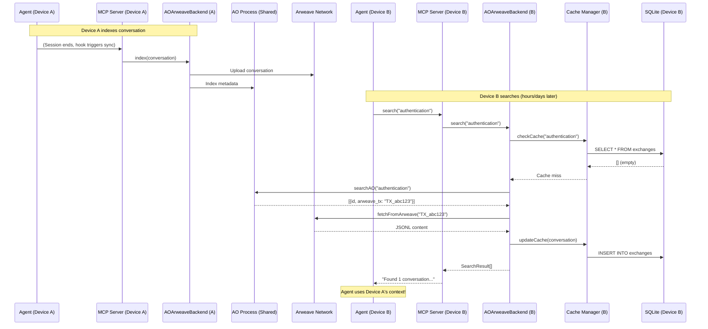
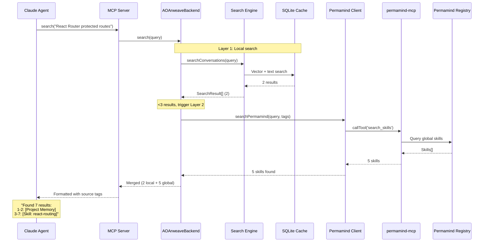

# Episodic Memory v2.0 - Target Architecture Document

## Introduction

This document outlines the **target architecture** for Episodic Memory v2.0, which enhances the existing local SQLite-based conversation search system with decentralized cross-device memory via AO/Arweave and hierarchical knowledge search via Permamind integration.

**Key Enhancement:** Hybrid backend architecture enabling:
- ✅ Cross-device agent continuity (remember context when switching machines)
- ✅ Multi-agent shared memory (dev/PM/QA agents collaborate)
- ✅ Hierarchical search (local project → global skills registry)
- ✅ Knowledge publishing (conversations → reusable skills)
- ✅ Permanent archive (immutable Arweave storage)
- ✅ Backward compatible (local SQLite continues working)

**Baseline Reference:** See `docs/brownfield-architecture.md` for current v1.0.9 implementation.

### Starter Template or Existing Project

**Status:** Brownfield Enhancement

This is an **existing production project** (v1.0.9) being enhanced, NOT a greenfield build. The current system is a mature TypeScript-based CLI tool with:
- ✅ Working SQLite + vector search (sqlite-vec)
- ✅ Local embedding generation (Transformers.js)
- ✅ MCP server integration with Claude Code
- ✅ Plugin distribution via superpowers-marketplace
- ✅ Production user base with conversation histories

**Architectural Constraints:**
- Must maintain backward compatibility (existing users on local-only mode)
- Must preserve current MCP tool interface (agent behavior unchanged)
- Must keep SQLite as performant cache layer
- Must support opt-in AO/Arweave (zero-friction for current users)

**Enhancement Approach:** Progressive enhancement via backend abstraction layer - existing code continues working while new AO/Arweave backend provides optional distributed functionality.

### Change Log

| Date       | Version | Description                          | Author      |
| ---------- | ------- | ------------------------------------ | ----------- |
| 2025-11-07 | 1.0     | Initial target architecture (v2.0)   | Winston (Architect) |

---

## High Level Architecture

### Technical Summary

Episodic Memory v2.0 is a **hybrid distributed semantic search system** that combines local SQLite caching with decentralized AO/Arweave storage for cross-device agent memory and hierarchical knowledge discovery.

**Architecture Style:** Opt-in progressive enhancement with backend abstraction - local-only SQLite (current) seamlessly upgrades to hybrid distributed mode (AO metadata index + Arweave permanent storage) when configured.

**Technology Stack:** TypeScript/Node.js backend with three-tier MCP orchestration pattern: episodic-memory MCP server calls permaweb-mcp (AO/Arweave operations) and permamind-mcp (skill registry), eliminating need for custom blockchain SDKs.

**Key Integration Points:**
- **Frontend to Backend:** MCP tool interface (search/read) - backend abstraction makes local vs distributed transparent to agent
- **Backend to Storage:** SearchBackend interface with LocalSQLiteBackend and AOArweaveBackend implementations
- **Distributed Services:** MCP tool orchestration via ClaudeCodeSDK.callTool() to permaweb-mcp and permamind-mcp
- **Hierarchical Memory:** Two-layer search (Layer 1: local episodic-memory → Layer 2: global permamind registry)

**Infrastructure Platform:** Edge-distributed hybrid approach - local SQLite on user machines + decentralized AO processes (Arweave blockchain) + permanent content storage (Arweave network). No centralized servers required.

**How This Achieves PRD Goals:**
- Cross-device continuity: AO process provides shared metadata index, Arweave provides content sync
- Multi-agent collaboration: Shared AO process enables team memory pools
- Hierarchical search: Local project memory preferred, global skills registry as fallback
- Knowledge publishing: Conversations → SKILL.md → Permamind registry (cross-project learning)
- Backward compatibility: Backend abstraction allows local-only mode (zero config required)

### Platform and Infrastructure Choice

**Platform:** Decentralized Hybrid (Local + Blockchain)

**Architecture Pattern:**
- **Local Tier:** SQLite database on each device (fast cache, offline access)
- **Metadata Tier:** AO (Actor Oriented) processes on Arweave (shared metadata index)
- **Content Tier:** Arweave permanent storage (immutable conversation archive)
- **Orchestration Tier:** MCP servers (episodic-memory, permaweb-mcp, permamind-mcp)

**Selected Platform:** Decentralized Hybrid

**Key Services:**
- **AO (Actor Oriented):** Lua-based process for metadata indexing and queries
- **Arweave:** Permanent data storage with transaction-based addressing
- **Permamind Registry:** Global skill discovery on Arweave/AO
- **SQLite:** Local cache layer (fast, offline-capable)
- **MCP Servers:** permaweb-mcp (blockchain ops), permamind-mcp (skills), episodic-memory (search orchestration)

**Deployment Host and Regions:**
- **Local:** User machines (macOS, Linux, Windows via Node.js)
- **AO Processes:** Arweave network (globally distributed nodes)
- **Arweave Storage:** Arweave network (globally replicated)
- **No Regional Configuration:** Decentralized - no region selection needed

### Repository Structure

**Structure:** Single Package (existing repository maintained)

**Monorepo Tool:** N/A - This is a CLI tool, not a monorepo. Single `package.json` with TypeScript compilation.

**Package Organization:**
- **Source:** `src/` - Core TypeScript modules (indexer, search, db, embeddings, parser, mcp-server, **NEW:** backend/, ao/, arweave/, cache/, config/)
- **CLI:** `cli/` - Executable wrappers (episodic-memory.js, mcp-server-wrapper.js)
- **Plugin:** `.claude-plugin/` - Claude Code plugin manifest, agents, hooks
- **Tests:** `test/` - Vitest test suite
- **Docs:** `docs/` - Architecture, schema, guides
- **Build:** `dist/` - Compiled JavaScript (tsc + esbuild bundle)

**New Module Structure for v2.0:**
```
src/
├── backend/                 # NEW: Backend abstraction
│   ├── interface.ts         # SearchBackend interface
│   ├── local.ts             # LocalSQLiteBackend (existing code wrapped)
│   ├── ao-arweave.ts        # AOArweaveBackend (hybrid implementation)
│   ├── router.ts            # Backend selection logic
│   └── factory.ts           # createBackend() factory
├── ao/                      # NEW: AO-specific (via permaweb-mcp)
│   ├── client.ts            # Wrapper for sendAOMessage/readAOProcess
│   ├── handlers.lua         # Lua process handlers
│   ├── spawn.ts             # Process deployment
│   └── types.ts             # AO message types
├── arweave/                 # NEW: Arweave-specific (via permaweb-mcp)
│   ├── upload.ts            # Wrapper for uploadToArweave tool
│   ├── download.ts          # HTTP gateway fetch
│   └── types.ts             # Transaction types
├── cache/                   # NEW: SQLite cache management
│   ├── manager.ts           # Cache CRUD, TTL, LRU eviction
│   └── types.ts             # Cache metadata types
├── config/                  # NEW: Configuration system
│   ├── manager.ts           # Config load/save (zod validation)
│   ├── wizard.ts            # Interactive setup
│   └── schema.ts            # Config schema definitions
├── [existing modules]       # db, embeddings, indexer, parser, search, sync, etc.
└── mcp-server.ts            # MODIFIED: Uses backend abstraction
```

### High Level Architecture Diagram



### Architectural Patterns

- **Backend Abstraction (Repository Pattern):** `SearchBackend` interface isolates storage implementation details - `LocalSQLiteBackend` and `AOArweaveBackend` interchangeable. _Rationale:_ Enables backward compatibility, testability with mocks, future backend additions

- **MCP Orchestration (Service Mesh Pattern):** Episodic-memory MCP server orchestrates permaweb-mcp and permamind-mcp tools via `ClaudeCodeSDK.callTool()`. _Rationale:_ Eliminates ~70% of implementation code, leverages tested upstream tools, separation of concerns

- **Hybrid Cache-Aside Pattern:** SQLite acts as read-through cache for AO/Arweave - check cache first, fetch on miss, populate cache. _Rationale:_ Maintains local performance (<10ms), enables offline access, reduces blockchain query costs

- **Factory Pattern (Backend Selection):** `createBackend(config)` returns appropriate backend based on configuration. _Rationale:_ Single decision point for backend routing, clean separation, easy testing

- **Hierarchical Search (Fallback Pattern):** Layer 1 (local episodic-memory) → Layer 2 (global permamind) with <3 results threshold trigger. _Rationale:_ Prefers project-specific context, enriches with global knowledge when local insufficient

- **Atomic File Sync (Temp + Rename):** Write to temp file, rename on success (existing pattern, maintained). _Rationale:_ Prevents partial writes, ensures consistency across crashes

- **Event-Driven Hooks (Observer Pattern):** Session-end hook triggers sync automatically (existing, maintained). _Rationale:_ Zero-friction UX, autonomous agent behavior

---

## Tech Stack

This is the **DEFINITIVE** technology selection for Episodic Memory v2.0. All development must use these exact versions. Changes to this table require architectural review.

### Technology Stack Table

| Category | Technology | Version | Purpose | Rationale |
|----------|------------|---------|---------|-----------|
| **Runtime** | Node.js | 18+ | JavaScript runtime for CLI and MCP server | ES Modules support required, existing baseline |
| **Language** | TypeScript | ^5.9.3 | Type-safe development | Strict mode enforced, existing codebase standard |
| **Package Manager** | npm | 8+ | Dependency management | Standard tooling, package-lock.json for reproducibility |
| **Database** | better-sqlite3 | ^12.4.1 | Local SQLite with synchronous API | Native performance, existing proven solution, WAL mode for concurrency |
| **Vector Search** | sqlite-vec | ^0.1.7-alpha.2 | Vector similarity search extension | Fast local vector search, integrates with SQLite, 384-dim support |
| **Embeddings** | @xenova/transformers | ^2.17.2 | Local embedding generation (Transformers.js) | Offline-first (no API), all-MiniLM-L6-v2 model, proven 384-dim vectors |
| **AI SDK** | @anthropic-ai/claude-agent-sdk | ^0.1.9 | Conversation summarization + MCP tool orchestration | Existing for summaries, **NEW USE:** ClaudeCodeSDK.callTool() for MCP orchestration |
| **MCP Framework** | @modelcontextprotocol/sdk | ^1.20.0 | MCP server implementation | Standard protocol for Claude integration, existing baseline |
| **MCP Orchestration** | permaweb-mcp | latest (npx) | AO/Arweave operations via MCP tools | **NEW:** Replaces custom aoconnect/arweave SDKs (~70% code reduction) |
| **MCP Orchestration** | @permamind/mcp | latest (npx) | Skill registry via MCP tools | **NEW:** Global knowledge discovery, hierarchical search Layer 2 |
| **Validation** | zod | ^3.25.76 | Input validation and schema definition | Type-safe runtime validation, existing for MCP tools, **NEW:** config validation |
| **Markdown** | marked | ^16.4.0 | Conversation display formatting | Existing for CLI output, maintained for compatibility |
| **Build Tool** | TypeScript Compiler (tsc) | ^5.9.3 | Compile TypeScript to JavaScript | Standard compilation, dist/ output |
| **Bundler** | esbuild | ^0.25.11 | Bundle MCP server with dependencies | Fast bundling, handles native module externals, existing baseline |
| **Test Framework** | vitest | ^3.2.4 | Unit and integration testing | Fast, TypeScript-native, existing test suite |
| **CLI Framework** | Native Node.js | - | Command-line interface | Lightweight, no heavy framework needed |

### Technology Additions for v2.0

**NEW Dependencies:**
- **None required in package.json** - MCP orchestration pattern means permaweb-mcp and permamind-mcp run as separate processes (npx), not direct dependencies
- **Benefit:** Zero new production dependencies, simpler security audits, upstream updates automatic

**REMOVED Dependencies (from earlier designs):**
- ~~@permaweb/aoconnect~~ → Replaced by permaweb-mcp MCP tools
- ~~arweave SDK~~ → Replaced by permaweb-mcp MCP tools
- ~~@permaweb/wallet-kit~~ → Handled by permaweb-mcp (SEED_PHRASE env var)

**Configuration Requirements:**
- **SEED_PHRASE environment variable:** 12-word mnemonic for Arweave wallet (shared by permaweb-mcp and permamind-mcp)
- **AO_PROCESS_ID:** Optional config for AO process (enables distributed mode)

### Technology Constraints

**Locked Decisions (Cannot Change Without Major Impact):**
- **Embedding Model:** all-MiniLM-L6-v2 (384-dim) - Changing requires full database re-index
- **SQLite:** Core persistence layer - Migration to PostgreSQL/other would break existing users
- **Node.js 18+:** ES Modules dependency - Cannot support older Node versions
- **MCP Protocol:** Integration contract with Claude Code - Must maintain MCP 1.x compatibility

**Platform Compatibility:**
- **macOS:** Primary development platform, fully supported
- **Linux:** Fully supported (better-sqlite3 compiles cleanly)
- **Windows:** Supported as of v1.0.8 (postinstall rebuild fixes)

**Native Module Considerations:**
- **better-sqlite3:** Requires Python/build tools for native compilation
- **Mitigation:** Postinstall script (`npm rebuild better-sqlite3`) handles compilation
- **Risk:** CI/CD pipelines need build tools installed

---

## Data Models

This section defines the core business entities and their TypeScript representations. These models are shared across local SQLite, AO processes, and Arweave storage.

### ConversationExchange (Core Entity)

**Purpose:** Represents a single user-assistant exchange pair from a Claude Code conversation. This is the atomic unit of memory that gets indexed, searched, and retrieved.

**TypeScript Interface:**

```typescript
interface ConversationExchange {
  id: string;
  project: string;
  timestamp: string;
  userMessage: string;
  assistantMessage: string;
  archivePath: string;
  lineStart: number;
  lineEnd: number;

  // Optional context
  parentUuid?: string;
  isSidechain?: boolean;
  sessionId?: string;
  cwd?: string;
  gitBranch?: string;
  claudeVersion?: string;
  thinkingLevel?: string;
  thinkingDisabled?: boolean;
  thinkingTriggers?: string;

  // Relationships
  toolCalls?: ToolCall[];

  // NEW v2.0: Cache metadata (SQLite only)
  arweave_tx?: string;      // Arweave transaction ID
  last_cached?: number;      // Unix timestamp
  cache_ttl?: number;        // TTL in milliseconds
}
```

### ToolCall (Sub-Entity)

**Purpose:** Tracks tool usage within an exchange for search filtering and analysis.

```typescript
interface ToolCall {
  id: string;
  exchangeId: string;
  toolName: string;
  toolInput?: any;         // JSON object, structure varies by tool
  toolResult?: string;     // Raw tool output
  isError: boolean;
  timestamp: string;
}
```

### SearchResult (Query Response)

**Purpose:** Wraps a ConversationExchange with search metadata for display.

```typescript
interface SearchResult {
  exchange: ConversationExchange;
  similarity: number;
  snippet: string;
  source?: 'cache' | 'ao' | 'arweave' | 'permamind'; // NEW v2.0
}
```

### MultiConceptResult (Advanced Search)

```typescript
interface MultiConceptResult {
  exchange: ConversationExchange;
  snippet: string;
  conceptSimilarities: number[];
  averageSimilarity: number;
}
```

### AOConversationMetadata (NEW v2.0)

**Purpose:** Lightweight metadata stored in AO process for fast querying.

```typescript
interface AOConversationMetadata {
  id: string;
  project: string;
  timestamp: string;
  arweave_conversation: string;
  arweave_summary?: string;
  tool_names: string[];
  tags: string[];
  snippet: string;
  session_id?: string;
  git_branch?: string;
}
```

### Config (NEW v2.0)

**Purpose:** User configuration for backend selection, wallet, AO process, and cache behavior.

```typescript
interface Config {
  version: string;
  defaultBackend: 'local' | 'ao' | 'hybrid';

  // AO configuration
  aoProcessId?: string;
  aoNetwork?: 'mainnet' | 'testnet';

  // Arweave configuration
  wallet?: string;
  arweaveGateway?: string;

  // Cache configuration
  cache: {
    enabled: boolean;
    ttl: number;
    maxSize: number;
    strategy: 'recent' | 'frequent' | 'all' | 'none';
  };

  // Project-specific backend overrides
  projects?: {
    [projectName: string]: 'local' | 'ao';
  };
}
```

### SyncStatus (NEW v2.0)

**Purpose:** Tracks synchronization state for resumable uploads.

```typescript
interface SyncStatus {
  conversation_id: string;
  synced_to_ao: boolean;
  synced_to_arweave: boolean;
  arweave_tx?: string;
  ao_indexed_at?: number;
  last_sync_attempt?: number;
  sync_error?: string;
}
```

### PermamindSkill (NEW v2.0)

**Purpose:** Represents a published skill in Permamind registry.

```typescript
interface PermamindSkill {
  id: string;
  title: string;
  description: string;
  tags: string[];
  content: string;  // Full SKILL.md markdown
  original_conversation_id?: string;
  author: string;
  created_at: string;
}
```

---

## API Specification

Episodic Memory v2.0 exposes APIs at two levels: **MCP Tools** (public interface for Claude agents) and **Backend Interfaces** (internal abstraction for storage implementations).

### MCP Tools (Public Agent Interface)

The MCP server exposes two tools to Claude agents. These tool interfaces remain **unchanged from v1.0.9** to maintain backward compatibility.

**Tool 1: search**

**Input Schema:**

```typescript
{
  query: string | string[];
  mode?: "vector" | "text" | "both";
  limit?: number;
  after?: string;
  before?: string;
  response_format?: "markdown" | "json";
}
```

**Output:** Markdown-formatted search results with source indicators (cache, AO, Arweave, Permamind).

**NEW v2.0 Behavior:**
- Hierarchical search: If local results <3, automatically searches Permamind registry
- Source indicator: Shows whether result from cache, AO, Arweave, or Permamind
- Transparent backend: Agent unaware of local vs distributed backend

**Tool 2: read**

**Input Schema:**

```typescript
{
  path: string;
  startLine?: number;
  endLine?: number;
}
```

**Output:** Markdown-formatted conversation with user/assistant exchanges.

**NEW v2.0 Behavior:**
- If path not in local cache, fetches from Arweave (via arweave_tx lookup)
- Caches fetched conversations for future reads
- Transparently handles local vs distributed storage

### Backend Interface (Internal Abstraction)

```typescript
interface SearchBackend {
  search(
    query: string | string[],
    options: SearchOptions
  ): Promise<SearchResult[]>;

  index(
    exchange: ConversationExchange,
    embedding: Float32Array,
    toolNames?: string[]
  ): Promise<void>;

  sync(options?: SyncOptions): Promise<SyncResult>;

  read(
    identifier: string,
    lineRange?: { startLine: number; endLine: number }
  ): Promise<string>;
}
```

### AO Process Handler API (Lua)

**Handler: IndexConversation**

```lua
Handlers.add(
  "IndexConversation",
  Handlers.utils.hasMatchingTag("Action", "IndexConversation"),
  function(msg)
    local metadata = json.decode(msg.Data)

    -- Store in Conversations table
    Conversations[metadata.id] = metadata

    -- Update project index
    if not Projects[metadata.project] then
      Projects[metadata.project] = {
        conversation_count = 0,
        conversation_ids = {}
      }
    end
    Projects[metadata.project].conversation_count =
      Projects[metadata.project].conversation_count + 1
    table.insert(Projects[metadata.project].conversation_ids, metadata.id)

    -- Update tag index
    for _, tag in ipairs(metadata.tags) do
      if not Tags[tag] then Tags[tag] = {} end
      table.insert(Tags[tag], metadata.id)
    end

    ao.send({ Target = msg.From, Data = "Indexed: " .. metadata.id })
  end
)
```

**Handler: SearchConversations**

```lua
Handlers.add(
  "SearchConversations",
  Handlers.utils.hasMatchingTag("Action", "SearchConversations"),
  function(msg)
    local query = msg.Tags.Query:lower()
    local project = msg.Tags.Project
    local limit = tonumber(msg.Tags.Limit) or 10

    local results = {}
    local count = 0

    for id, conv in pairs(Conversations) do
      if count >= limit then break end

      if project and conv.project ~= project then
        goto continue
      end

      if string.find(conv.snippet:lower(), query) then
        table.insert(results, conv)
        count = count + 1
      end

      ::continue::
    end

    ao.send({ Target = msg.From, Data = json.encode(results) })
  end
)
```

---

## Components

This section defines the major functional components in Episodic Memory v2.0.

### Component Diagram



### Key Components

**MCP Server:** Exposes search/read tools, orchestrates backend operations, manages hierarchical search fallback

**Backend Abstraction Layer:** Unified interface for storage operations (LocalSQLiteBackend, AOArweaveBackend)

**AOArweaveBackend:** Hybrid distributed backend (uploads to Arweave, indexes to AO, caches in SQLite)

**AO Client:** Wrapper for AO operations via permaweb-mcp tools

**Arweave Client:** Wrapper for Arweave operations via permaweb-mcp tools

**Cache Manager:** SQLite cache management (TTL, LRU eviction, statistics)

**Configuration Manager:** Config load/save/validation, interactive setup wizard

**Permamind Integration:** Layer 2 hierarchical search, skill publishing

---

## Core Workflows

### Workflow 1: Conversation Indexing Flow (Hybrid Backend)



### Workflow 2: Cross-Device Sync Flow



### Workflow 3: Hierarchical Search Flow (Local → Global)



---

## Database Schema

### SQLite Schema (Enhanced for v2.0)

**Database File:** `~/.claude/conversation-search/conversations.db`

**Table: exchanges**

```sql
CREATE TABLE IF NOT EXISTS exchanges (
  id TEXT PRIMARY KEY,
  project TEXT NOT NULL,
  timestamp TEXT NOT NULL,
  user_message TEXT NOT NULL,
  assistant_message TEXT NOT NULL,
  archive_path TEXT NOT NULL,
  line_start INTEGER NOT NULL,
  line_end INTEGER NOT NULL,

  -- Optional context
  parent_uuid TEXT,
  is_sidechain BOOLEAN DEFAULT 0,
  session_id TEXT,
  cwd TEXT,
  git_branch TEXT,
  claude_version TEXT,
  thinking_level TEXT,
  thinking_disabled BOOLEAN,
  thinking_triggers TEXT,

  -- NEW v2.0: Cache metadata
  arweave_tx TEXT,
  last_cached INTEGER,
  cache_ttl INTEGER DEFAULT 604800000,

  UNIQUE(archive_path, line_start, line_end)
);

CREATE INDEX IF NOT EXISTS idx_exchanges_project ON exchanges(project);
CREATE INDEX IF NOT EXISTS idx_exchanges_timestamp ON exchanges(timestamp);
CREATE INDEX IF NOT EXISTS idx_exchanges_arweave_tx ON exchanges(arweave_tx);
CREATE INDEX IF NOT EXISTS idx_exchanges_last_cached ON exchanges(last_cached);
```

**Table: tool_calls**

```sql
CREATE TABLE IF NOT EXISTS tool_calls (
  id TEXT PRIMARY KEY,
  exchange_id TEXT NOT NULL,
  tool_name TEXT NOT NULL,
  tool_input TEXT,
  tool_result TEXT,
  is_error BOOLEAN DEFAULT 0,
  timestamp TEXT NOT NULL,

  FOREIGN KEY (exchange_id) REFERENCES exchanges(id) ON DELETE CASCADE
);

CREATE INDEX IF NOT EXISTS idx_tool_calls_exchange ON tool_calls(exchange_id);
CREATE INDEX IF NOT EXISTS idx_tool_calls_tool_name ON tool_calls(tool_name);
```

**Table: vec_exchanges (Virtual Table)**

```sql
CREATE VIRTUAL TABLE IF NOT EXISTS vec_exchanges USING vec0(
  id TEXT PRIMARY KEY,
  embedding FLOAT[384]
);
```

**Table: sync_status (NEW v2.0)**

```sql
CREATE TABLE IF NOT EXISTS sync_status (
  conversation_id TEXT PRIMARY KEY,
  synced_to_ao BOOLEAN DEFAULT 0,
  synced_to_arweave BOOLEAN DEFAULT 0,
  arweave_tx TEXT,
  ao_indexed_at INTEGER,
  last_sync_attempt INTEGER,
  sync_error TEXT,

  FOREIGN KEY (conversation_id) REFERENCES exchanges(id) ON DELETE CASCADE
);

CREATE INDEX IF NOT EXISTS idx_sync_status_synced
  ON sync_status(synced_to_ao, synced_to_arweave);
```

**Table: suggested_skills (NEW v2.0)**

```sql
CREATE TABLE IF NOT EXISTS suggested_skills (
  conversation_id TEXT PRIMARY KEY,
  suggested_at INTEGER NOT NULL,
  user_action TEXT,
  skill_id TEXT,

  FOREIGN KEY (conversation_id) REFERENCES exchanges(id) ON DELETE CASCADE
);
```

### AO Process Schema (Lua Tables)

**Conversations Table:**

```lua
Conversations = {
  ["conv-id-1"] = {
    id = "conv-id-1",
    project = "my-app",
    timestamp = "2025-11-07T14:00:00Z",
    arweave_conversation = "TX_ABC123",
    arweave_summary = "TX_DEF456",
    tool_names = {"Read", "Edit", "Bash"},
    tags = {"bug-fix", "authentication"},
    snippet = "First 200 chars...",
    session_id = "session-abc",
    git_branch = "main"
  }
}
```

**Projects Table:**

```lua
Projects = {
  ["my-app"] = {
    conversation_count = 1523,
    last_updated = "2025-11-07T14:00:00Z",
    conversation_ids = {"conv-id-1", "conv-id-2", ...}
  }
}
```

**Tags Table:**

```lua
Tags = {
  ["bug-fix"] = {"conv-id-1", "conv-id-12"},
  ["authentication"] = {"conv-id-1", "conv-id-45"}
}
```

### Arweave Data Model

**Conversation Upload:**
- File: JSONL with transaction tags (Content-Type, App-Name, Conversation-Id, Project, Timestamp)
- Returns: Transaction ID (43-char base64url)

**Summary Upload:**
- File: Plain text with tags (Type: summary, Conversation-Id)
- Returns: Transaction ID

**Retrieval:**
- Fetch via HTTP: `https://arweave.net/{txId}`

---

## Integration Patterns

### MCP Tool Orchestration Pattern

```typescript
import { ClaudeCodeSDK } from '@anthropic-ai/claude-agent-sdk';

const claude = new ClaudeCodeSDK();

export class AOArweaveBackend implements SearchBackend {
  async uploadConversation(filePath: string): Promise<string> {
    const result = await claude.callTool('mcp__permaweb__uploadToArweave', {
      filePath: filePath,
      paymentMethod: 'tokens'
    });
    return this.extractTxId(result.content[0].text);
  }

  async indexToAO(
    processId: string,
    conversation: ConversationExchange,
    arweaveTx: string
  ): Promise<void> {
    await claude.callTool('mcp__permaweb__sendAOMessage', {
      processId: processId,
      tags: [
        { name: 'Action', value: 'IndexConversation' },
        { name: 'ConversationId', value: conversation.id }
      ],
      data: JSON.stringify({ ...conversation, arweave_conversation: arweaveTx })
    });
  }
}
```

### Backend Abstraction Pattern

```typescript
interface SearchBackend {
  search(query: string | string[], options: SearchOptions): Promise<SearchResult[]>;
  index(exchange: ConversationExchange, embedding: Float32Array): Promise<void>;
  sync(options?: SyncOptions): Promise<SyncResult>;
}

function createBackend(config: Config): SearchBackend {
  if (config.aoProcessId && config.wallet) {
    return new AOArweaveBackend(config);
  }
  return new LocalSQLiteBackend(config);
}
```

### Hybrid Cache-Aside Pattern

```typescript
async search(query: string, options: SearchOptions): Promise<SearchResult[]> {
  // 1. Check SQLite cache
  const cached = await this.cacheManager.checkCache(query, options);
  if (cached && this.isCacheFresh(cached)) {
    return cached.results;
  }

  try {
    // 2. Query AO for metadata
    const aoResults = await this.aoClient.searchAO(processId, query);

    // 3. Fetch from Arweave (parallel)
    const conversations = await Promise.all(
      aoResults.map(m => this.arweaveClient.fetchFromArweave(m.arweave_conversation))
    );

    // 4. Update cache
    await this.cacheManager.updateCache(conversations);

    return conversations;
  } catch (error) {
    // 5. Graceful degradation: stale cache
    if (cached) {
      console.warn('Using stale cache', error);
      return cached.results;
    }
    throw error;
  }
}
```

### Error Handling Strategy

```typescript
class AOConnectionError extends Error {
  constructor(message: string, public processId: string) {
    super(message);
    this.name = 'AOConnectionError';
  }
}

// Retry with exponential backoff
async function withRetry<T>(
  fn: () => Promise<T>,
  maxRetries = 3,
  baseDelay = 1000
): Promise<T> {
  for (let i = 0; i < maxRetries; i++) {
    try {
      return await fn();
    } catch (error) {
      if (i === maxRetries - 1) throw error;
      await sleep(baseDelay * Math.pow(2, i));
    }
  }
  throw new Error('Max retries exceeded');
}
```

### Security & Privacy

**Wallet Management:**
- SEED_PHRASE environment variable (12-word mnemonic)
- Never logged or stored in code
- User responsible for secure storage

**Data Privacy:**
- Local SQLite cache remains private
- Arweave uploads PUBLIC by default
- Optional encryption (future enhancement)
- No PII in error logs

---

## Deployment Architecture

### Deployment Strategy

**Deployment Model:** Distributed edge deployment - software runs on user machines, data stored locally + decentralized network.

**Local Deployment:**
- SQLite: `~/.claude/conversation-search/conversations.db`
- Archive: `~/.claude/conversation-search/archive/`
- Config: `~/.episodic-memory/config.json`
- MCP Servers: episodic-memory (local), permaweb-mcp (npx), permamind-mcp (npx)

**Decentralized Layer:**
- AO Processes: Arweave network (globally distributed)
- Arweave Storage: Permanent content (globally replicated)
- Permamind Registry: Global skill index

**Build Command:**

```bash
npm run build
# 1. tsc (TypeScript compilation)
# 2. npm run bundle (esbuild MCP server)
# 3. npm run build:ao-handlers (cat Lua files)
```

### Environments

| Environment | Backend | AO Network | Purpose |
|-------------|---------|------------|---------|
| **Development** | local | N/A | Local testing |
| **Staging** | hybrid | testnet | AO/Arweave testing |
| **Production** | hybrid | mainnet | Real user data |

### Development Environment

**Setup:**

```bash
git clone https://github.com/obra/episodic-memory.git
cd episodic-memory
npm install
npm run build
npm test
```

**Environment Variables:**

```bash
export TEST_PROJECTS_DIR="./test/fixtures/projects"
export ANTHROPIC_API_KEY="sk-ant-..."
export SEED_PHRASE="word1 word2 ... word12"  # Optional
```

### Production Environment

**Configuration:**

```json
{
  "version": "2.0.0",
  "defaultBackend": "hybrid",
  "aoProcessId": "p_prod_xyz789...",
  "aoNetwork": "mainnet",
  "wallet": "SEED_PHRASE",
  "cache": {
    "enabled": true,
    "ttl": 604800000,
    "maxSize": 104857600,
    "strategy": "recent"
  }
}
```

**AO Process Deployment:**

```bash
episodic-memory ao deploy --network mainnet
# Output: Process deployed: p_prod_xyz789...

episodic-memory config set ao-process-id p_prod_xyz789...
episodic-memory config set ao-network mainnet
```

**Initial Migration:**

```bash
episodic-memory sync
# Uploads existing conversations to Arweave + AO
```

### Monitoring and Observability

**Metrics:**

```bash
episodic-memory stats

# Output:
# Backend: AO/Arweave (mainnet)
# Cache: 87 conversations (5.2MB), hit rate: 91%
# Indexed: 1523 conversations
```

**Logging:**

```typescript
logger.info('Uploading to Arweave', { conversationId, size });
logger.warn('AO process slow', { processId, latency: 2500 });
logger.error('Upload failed', { conversationId, error: e.message });
```

### Disaster Recovery

**Backup:**

```bash
# Local SQLite backup
cp ~/.claude/conversation-search/conversations.db ~/backups/

# Arweave: Permanent (no backups needed)
# Wallet: User must backup SEED_PHRASE
```

**Recovery:**

```bash
# Database corruption
episodic-memory index --verify
episodic-memory index --repair

# Re-sync from AO/Arweave
rm ~/.claude/conversation-search/conversations.db*
episodic-memory sync
```

### Cost Management

**Arweave Storage Costs:**

| Conversations | Size | Cost (USD @ $20/AR) |
|---------------|------|---------------------|
| 100           | 1MB  | $0.003              |
| 1,000         | 10MB | $0.03               |
| 10,000        | 100MB| $0.30               |

---

## Cross-References

- **Requirements:** See `docs/prd.md` for complete PRD v2.0
- **Current State:** See `docs/brownfield-architecture.md` for v1.0.9 baseline
- **Database Details:** See `docs/SCHEMA.md` for complete schema reference
- **Stories:** See `docs/prd.md` Epic 1 Stories 1.1-1.18 for implementation sequence

---

## Document Status

**Version:** 1.0
**Status:** Target Architecture (v2.0)
**Last Updated:** 2025-11-07
**Author:** Winston (Architect)
**Review Status:** Ready for Development

---

_🤖 Generated with [Claude Code](https://claude.com/claude-code)_

_Co-Authored-By: Claude <noreply@anthropic.com>_
